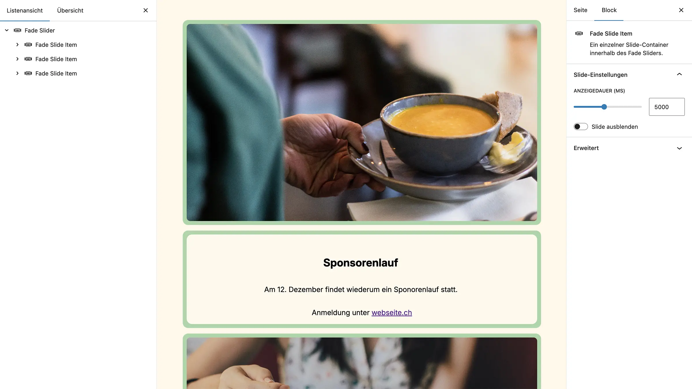
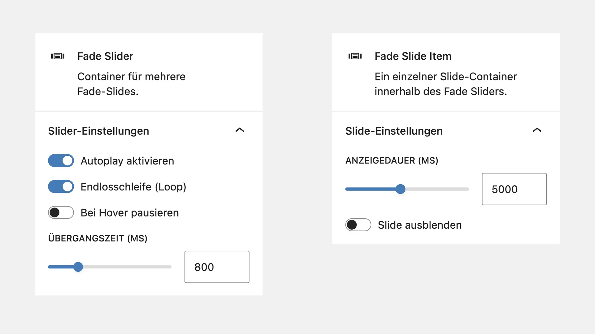

# UD Block: Fade Slider

Ein flexibler WordPress-Block zur Erstellung automatisch überblendender Slider.
Die Slides können beliebige Inhalte enthalten (Bilder, Text, Gruppen, Cover-Blöcke etc.).

## Funktionen

-   Automatisch überblendender Slider
-   Enthält einen übergeordneten **Fade Slider**-Block und mehrere **Fade Slide Items**
-   Jedes Slide kann beliebige Inhalte enthalten
-   **Fade-Geschwindigkeit** im Slider einstellbar
-   **Anzeigedauer** individuell pro Slide festlegbar
-   Optionales Autoplay, Loop und Pausieren bei Hover
-   Einzelne Slides können komplett ausgeblendet werden, ohne dass sie entfernt werden müssen

## Screenshots

*Frontend-Ansicht.*

*Frontend-Ansicht.*

*Editor-Ansicht.*

*Einstellungen für den gesamten Slider und die einzelnen Slides.*

## Aufbau

### Parent-Block: Fade Slider

Container für mehrere Slides. Steuert den Gesamtablauf und die Animation.

-   **Autoplay aktivieren** – startet die automatische Wiedergabe
-   **Endlosschleife (Loop)** – wiederholt die Slides unbegrenzt
-   **Bei Hover pausieren** – stoppt die Wiedergabe, solange der Mauszeiger über dem Slider ist
-   **Übergangszeit (ms)** – Dauer der Fade-Animation zwischen zwei Slides

### Child-Block: Fade Slide Item

Ein einzelner Slide innerhalb des Sliders. Kann beliebige Gutenberg-Blöcke enthalten.

-   **Anzeigedauer (ms)** – wie lange der Slide sichtbar bleibt, bevor der nächste eingeblendet wird
-   **Slide ausblenden** – blendet den Slide komplett aus (z. B. zur temporären Deaktivierung)

## Technische Details

-   Fade-Wechsel basiert auf CSS-Transitions (`opacity`)
-   Steuerung durch leichtes Vanilla-JS-Skript
-   Reagiert auf Editor-Attribute (`autoplay`, `loop`, `pauseOnHover`, `duration`, `fadeTime`)
-   Responsiv und FSE-kompatibel

## Installation

1. Ordner `ud-fade-slider-block` in
   `/wp-content/plugins/` kopieren
2. Im Backend unter **Plugins → Installierte Plugins** aktivieren
3. Den Block im Editor einfügen und konfigurieren

## Anforderungen

-   WordPress 6.7 oder neuer
-   PHP 8.0+
-   Aktives Theme: `ulrichdigital_block_theme`
-   Ably-API-Key für Echtzeit-Übertragung

## Autor

[ulrich.digital gmbh](https://ulrich.digital)

## Lizenz

Alle Rechte vorbehalten. Dieses Plugin ist urheberrechtlich geschützt und darf ohne ausdrückliche schriftliche Genehmigung der **ulrich.digital gmbh** weder kopiert, verbreitet, verändert noch weiterverwendet werden.
