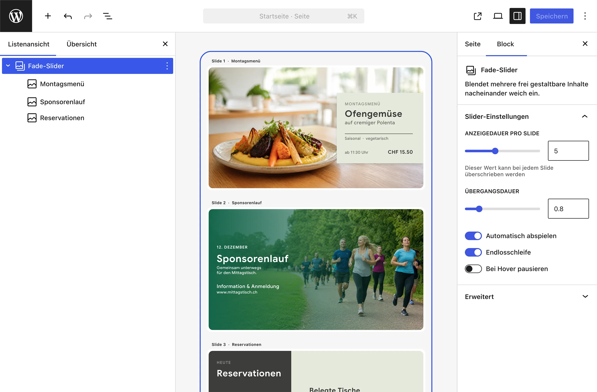

# UD Block: Fade Slider

Ein Gutenberg-Block für automatisch überblendende Inhaltsfolgen. Jede Slide wird mit beliebigen Gutenberg-Blöcken aufgebaut und kann dadurch Bilder, Texte, Gruppen, Cover-Blöcke und weitere Inhalte aufnehmen.

## Funktionen

- Automatisch überblendende Folge frei gestaltbarer Inhalte
- Übergeordneter **Fade Slider** mit mehreren untergeordneten **Fade Slides**
- Beliebige Gutenberg-Blöcke innerhalb jeder Slide
- Zentrale Steuerung von Übergang, automatischer Wiedergabe und Endlosschleife
- Individuelle Anzeigedauer pro Slide
- Einstellung zum Pausieren bei Hover
- Temporäres Ausblenden einzelner Slides

## Screenshots

*Die Editoransicht zeigt drei eigenständig aufgebaute Slides sowie die zentralen Einstellungen für Ablauf und Übergang.*

## Aufbau

### Parent-Block: Fade Slider

Container für mehrere Slides. Er steuert den Ablauf und die weiche Überblendung der gesamten Inhaltsfolge.

- **Übergangsdauer** – bestimmt die Dauer der weichen Überblendung
- **Automatisch abspielen** – startet die Inhaltsfolge selbstständig
- **Endlosschleife** – beginnt nach der letzten Slide wieder von vorne
- **Bei Hover pausieren** – steuert die vorgesehene Unterbrechung bei Mauszeigerkontakt

### Child-Block: Fade Slide Item

Eine einzelne Inhaltsfläche innerhalb des Sliders. Sie kann beliebige Gutenberg-Blöcke enthalten.

- **Anzeigedauer** – legt in Sekunden fest, wie lange die Slide sichtbar bleibt
- **Slide ausblenden** – deaktiviert eine vorbereitete Slide temporär, während ihr Inhalt erhalten bleibt

## Technische Details

- Fade-Wechsel auf Basis von CSS-Transitions (`opacity`)
- Steuerung durch JavaScript ohne zusätzliches Slider-Framework
- Verschachtelte Blockstruktur mit einem übergeordneten Slider und frei aufgebauten Slides
- Responsiv und mit dem WordPress Site Editor kompatibel

## Installation

1. Ordner `ud-fade-slider-block` nach `/wp-content/plugins/` kopieren
2. Im Backend unter **Plugins → Installierte Plugins** aktivieren
3. Den Block im Editor einfügen und konfigurieren

## Anforderungen

- WordPress 6.7 oder neuer
- PHP 8.0+

## Autor

[ulrich.digital gmbh](https://ulrich.digital)

## Lizenz

Alle Rechte vorbehalten. Dieses Plugin ist urheberrechtlich geschützt und darf ohne ausdrückliche schriftliche Genehmigung der **ulrich.digital gmbh** weder kopiert, verbreitet, verändert noch weiterverwendet werden.
